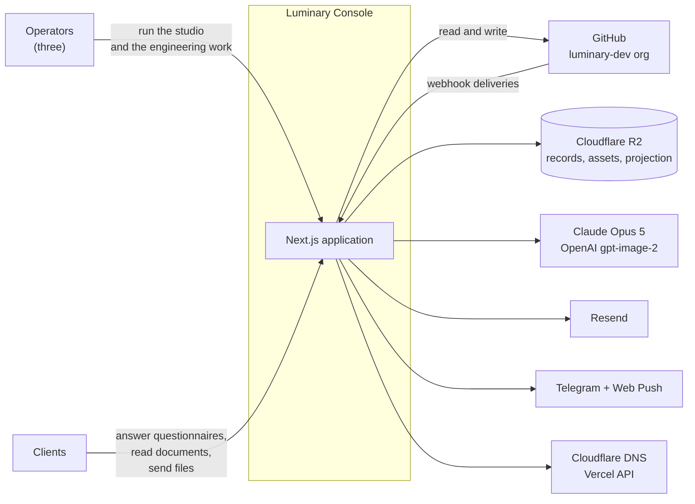
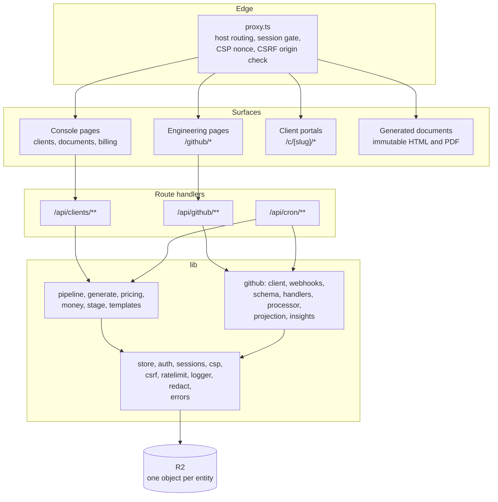
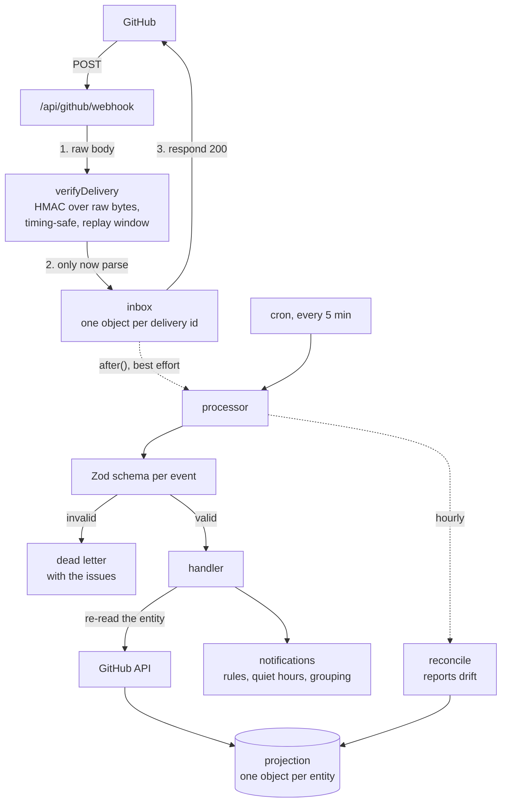

# Architecture

The console is one Next.js 16 application serving three audiences from one
codebase, separated by host. It has two halves that share plumbing but not
purpose: the **client-document platform** (the original product) and the
**engineering console** (the GitHub operations surface).

For what the system looked like before this work, see
`docs/audit/AS-BUILT-ARCHITECTURE.md`.

## C1: system context



## C2: containers

Everything runs inside one Vercel deployment. The "containers" here are
logical boundaries, not processes, which is itself an architectural decision:
see "Why one application" below.



## C3: the GitHub ingestion pipeline

The most involved component, and the one with the strongest invariants.



**The governing invariant**: handlers do not apply the payload, they re-read
the entity from the API and store that. This is what makes at-least-once
delivery, out-of-order arrival, and lost deliveries all safe, and why there is
no per-action logic for opened versus closed versus reopened. Full detail in
`docs/WEBHOOKS.md`.

## Key decisions

### Why one application rather than the workspace split

The target architecture in the audit's mandate is a pnpm/Turborepo workspace
with separate `web`, `api`, `worker` and library packages. This is one package.

The reason is the worker. A split earns its keep when the pieces deploy and
scale separately, and the piece that most wants to be separate here is webhook
processing. On Vercel there is no long-lived worker process: background work
is `after()` plus a cron-driven sweep, both of which run inside the same
deployment. Splitting the code into packages without splitting the runtime
would add build complexity and buy nothing today.

What was done instead: the GitHub layer is a self-contained module
(`lib/github/**`) with no imports from the client-document domain, testable in
isolation, and it would lift out of this repository unchanged. The seam exists;
only the packaging does not.

### Why R2 objects rather than Postgres

The mandate specifies PostgreSQL with Drizzle. The store is Cloudflare R2 with
one JSON object per entity. This is the largest deviation and it is a
constraint, not a preference: provisioning a database is the operators' call,
not something to do to a live system unasked.

What was done to make the flat store safe, since the audit found two real
defects in it:

- **Compare-and-swap** on every shared object using R2's conditional writes
  (`If-Match`, `If-None-Match`), with bounded retry, so concurrent writes
  cannot silently lose one another (LC-002).
- **Strict index reads**, so an unreadable index throws rather than being
  treated as empty and then written back as an empty index (LC-001).
- **One object per entity, never a shared array**, for deliveries, pull
  requests, runs, deployments, releases, alerts and notifications. A push fans
  out to five event types within milliseconds; per-entity keys mean those
  writers touch different objects and cannot race at all.

The migration path to Postgres is unchanged by any of this: the store is
behind `lib/store.ts` and the projection behind `lib/github/projection.ts`.
See `docs/MIGRATION-PLAN.md`.

### Why the projection at all

The `/github` screens read stored entities, not GitHub. Three reasons: the
screens cost no rate limit budget, they work when GitHub is degraded, and
merge readiness is derived once in one place so the list and the detail cannot
disagree. The cost is staleness, which is why every screen shows its sync age,
and why reconciliation reports drift rather than hiding it.

### Why the client owns rate limiting rather than an SDK

`lib/github/client.ts` is written rather than adopted because the hard parts
are exactly what a generic SDK abstracts away: primary versus secondary rate
limits need different backoff, `x-ratelimit-reset` can be in the past, `Link`
headers stop early, a 304 must return the cached body rather than an empty
one, and GitHub answers 502 on large queries. Each of those is a specific
behaviour with a specific test.

### Where GraphQL is used, and why only there

One query: the org-wide pull request inbox. Over REST that view is `1 + N + 2N`
calls across N repositories, which on this org is 60 or more round trips per
page load. Everything else is REST, because REST's errors are specific and its
permissions map cleanly onto the App's declared scopes. A REST fallback for the
inbox exists because fine-grained personal access tokens cannot use GraphQL at
all, and the console has to remain usable before the App is installed.

## Request lifecycle

1. **`proxy.ts`** runs on every non-static request. It routes by host (client
   subdomain versus console), enforces the session allowlist, generates the
   CSP nonce, applies the security headers for that surface, and checks the
   CSRF origin on cookie-authenticated mutations.
2. **Server components** read through `lib/store.ts` or
   `lib/github/projection.ts` and render.
3. **Route handlers** validate, act, audit, and answer with either a domain
   result or an RFC 9457 problem body from `lib/errors.ts`.
4. **Failures** go through one mapper, which logs the real cause under a
   request id and returns only safe text.

## Data model

`ClientRecord` is the aggregate root of the document platform; the GitHub side
projects `RepoEntity`, `PullRequestEntity`, `WorkflowRunEntity`,
`DeploymentEntity`, `ReleaseEntity` and `AlertEntity`, plus `StoredDelivery`
for the inbox and `SyncState` per resource. Full field lists in `lib/types.ts`
and `lib/github/entities.ts`.

Storage layout under the bucket:

```
console/
  index.json                     client index
  counter.json                   monotonic document number
  clients/<slug>/record.json     aggregate root
  clients/<slug>/{docs,billing,attachments}/...   immutable assets
  state/
    activity.json, sessions.json, revoked.json, ...
    github/
      deliveries/<id>.json       webhook inbox, one per delivery
      prs/<repo>/<number>.json   projection, one per entity
      repos/<repo>.json
      runs/<repo>/<id>.json
      notifications/<login>/<group>.json
      sync/<resource>.json
```

## What this architecture does not do

- No database, so no transactions across entities and no query layer.
- No queue, so processing is a cron sweep with an `after()` fast path.
- No real worker, so long jobs run inside a request with `maxDuration`.
- No tracing or metrics; see `docs/OBSERVABILITY.md`.
- No multi-tenancy. Three operators, one organisation, hardcoded.
