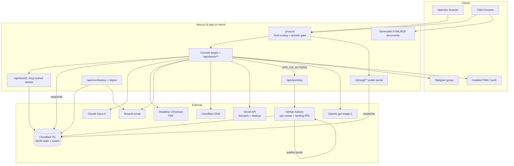

# As-built architecture — Luminary Console (2026-08-26)

What actually exists, not what the README or the master prompt describes. The
prompt targets a GitHub operations console; the code is a client-document
platform. This documents the latter.

## One-paragraph summary

A single Next.js 16 (App Router, Turbopack) application, no database, deployed on
Vercel. It has three faces sharing one codebase, separated by host in
`proxy.ts`: the **console** (operator-only, behind an email+password+OTP session
cookie), the **client portals** (`<slug>.luminary-dev.xyz`, public), and the
**generated documents** (branded HTML/PDF). Persistence is Cloudflare R2 over the
S3 API as flat JSON files on fixed keys plus immutable random-suffixed asset
objects. AI drafting is Claude Opus 5 with structured JSON-schema outputs.
Business mutations can optionally execute on GitHub Actions instead of in the
deployment (`OPS_VIA_ACTIONS`), which is also how the console runs "operations"
today. Notifications fan out to Telegram and Web Push. Subdomains are automated
via Cloudflare DNS + Vercel domains; finalized client sites deploy via the Vercel
upload API.

## Request routing (`proxy.ts`, middleware on every non-static request)

- Host is a **client host** (`*.luminary-dev.xyz` except the console/root):
  rewrite `/*` → `/c/<slug>/*`, harden, stamp the per-slug visit cookie on `/`.
- Host is the **console**: `/login`, `/api/auth`, `/api/logout`, `/api/cron/*`,
  and PWA assets are public; everything else requires a valid `lum_session`
  cookie (HMAC over `SESSION_SECRET`) whose `sid` is not revoked. Valid sessions
  slide the idle window. (Findings: LC-010 stateless logout, LC-031 revocation
  read on the cold path, LC-012 no CSP added here.)

## Layers

**Storage (`lib/store.ts`, `lib/r2.ts`, `lib/assets.ts`).** Fixed keys for
`index.json`, `counter.json`, per-client `record.json`, and `state/*` (OTP,
sessions, revoked, notifications, activity, doc views, push subscriptions).
Assets (`docs/`, `billing/`, `attachments/`, `answers`) get unique keys and are
never overwritten, so old renders stay reachable forever. A 5s per-instance read
cache sits over records+index. The bucket is private; assets reach the operator
through the authed `/api/asset/[...key]` stream and reach email through 7-day
presigned GETs. (Findings: LC-001, LC-002.)

**Auth (`lib/auth.ts`, `lib/users.ts`, `lib/otp.ts`, `lib/sessions.ts`,
`lib/operator.ts`).** Two-step login (email+password → emailed 6-digit OTP →
HMAC session cookie). Operators are `CONSOLE_USERS` env entries
(`email:salt:sha256(salt:password)`). A store-backed session registry powers the
dashboard's device list and revocation. (Findings: LC-010, LC-011, LC-015.)

**AI (`lib/generate.ts`, `lib/publish/draft.ts`).** Claude Opus 5 with
`output_config.format` JSON-schema structured outputs and server-side refusal
fallbacks. Stage 1 drafts the estimate + tailored questions; stage 2 drafts
quotation/proposal/contract from the answers; billing docs and revisions reuse
the same client. Output is `JSON.parse`d and cast, not validated. (Finding:
LC-004.)

**Pricing + money (`lib/pricing.ts`, `lib/money.ts`, `lib/pipeline.ts`).** A
deterministic fixed per-page pricing model the AI quotes verbatim; the pipeline
reconciles the drafted quotation's total and 30/70 schedule against it so money
cannot drift. Outstanding-balance math in `lib/money.ts`. (Finding: LC-003.)

**Rendering (`lib/templates/*`, `lib/pdf.ts`).** One shared document shell
(tokens, header, meta grid, footer, print rules) renders each contract to branded
HTML for web and print; `lib/pdf.ts` prints it to PDF via headless Chromium
(`@sparticuz/chromium` on Vercel, system Chrome locally), with a special
laptop-width full-height mode for design previews. (Finding: LC-032.)

**Notifications (`lib/notify.ts`, `lib/telegram.ts`, `lib/push.ts`,
`lib/email.ts`).** One `studioNotice` fans out to Telegram + Web Push; email via
Resend. All best-effort and guarded. (Findings: LC-017, LC-050.)

**Ops execution plane (`lib/ops-fetch.ts`, `lib/ghops.ts`,
`app/api/ops/relay/route.ts`, `scripts/ops.ts`, `scripts/invoke.ts`,
`.github/workflows/ops-*.yml`).** With `OPS_VIA_ACTIONS=1`, the client `opsFetch`
routes business mutations to `/api/ops/relay`, which dispatches the "Ops · Console
API" workflow; the runner invokes the same route handler in-process
(`scripts/invoke.ts` resolves the path against `app/**`) with Actions-secret
credentials and writes the response back into the store for the relay to return.
Reads always execute directly.

**Automation (`lib/domains.ts`, `lib/deploy.ts`).** Cloudflare CNAME + Vercel
domain attach for per-client portal subdomains and for finalized client sites;
finalized sites deploy by fetching the repo tarball and uploading files to the
Vercel API.

**Crons (`app/api/cron/backup`, `app/api/cron/digest`, `vercel.json`).** Weekly
backup zip + DNS health email; daily stalled-deal digest. Guarded by a
constant-time `CRON_SECRET` bearer check.

## Data model (on R2, `lib/types.ts`)

`ClientRecord` is the aggregate root: identity, `docs` (one slot per `DocType`),
`billing[]` (invoices, receipts, handover packs), `payments[]`, `changeOrders[]`,
`designs[]`, `site`, `submissions[]`, `comments[]`, `uploads[]`, `tasks[]`,
`notes`, lifecycle `stage`, acceptance/signature. Global state files:
`index.json`, `counter.json`, `activity.json`, `sessions.json`, `revoked.json`,
`notifications.json`, `activity_seen.json`, `doc_views.json`,
`push-subscriptions.json`, `auth/otp-*.json`, `ops-results/*.json`.

## Lifecycle

`lead → quoted → accepted → development → delivered → warranty → closed`
(`lib/stage.ts`), auto-advanced by pipeline events (publish quotation, portal
acceptance, payment, final receipt) with a time-based drift after delivery, plus a
manual override. (Finding: LC-025.)

## Diagram

## The three biggest architectural risks (all in the register)

1. **Flat-file store with no concurrency control and a wipe hazard** (LC-001,
   LC-002) — the foundation the whole product sits on.
2. **Stateless session validity** (LC-010) — "sign out" is not a logout.
3. **No test/observability/error-boundary layer** (LC-020, LC-052, LC-053,
   LC-054) — changes and outages are unverified and invisible.
